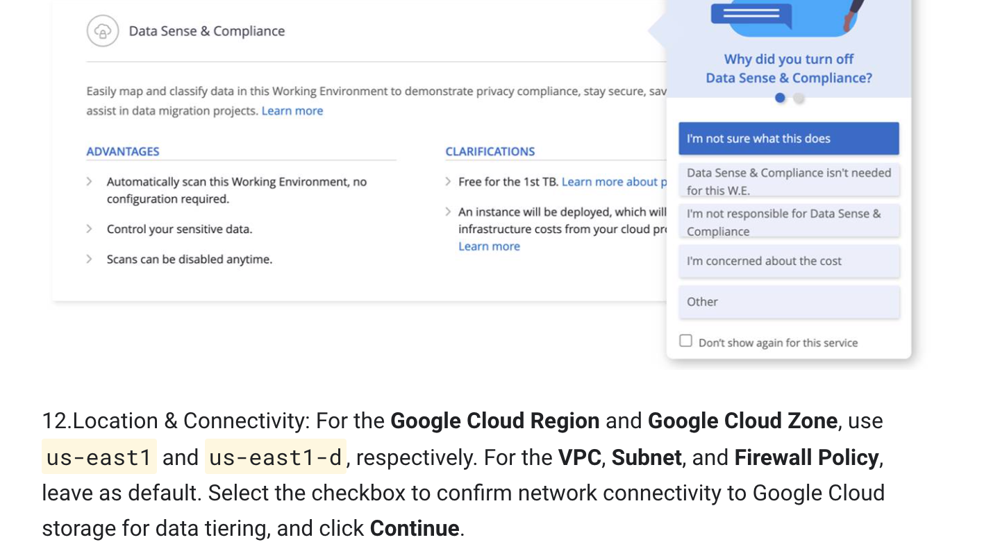

# Managing SMB Workloads and Optimizing Storage Usage with NetApp BlueXP & Cloud Volumes ONTAP

## Run in Cloud Shell

</img>

- eg: us-east1
```
export REGION=
```
- eg: us-east1-d
```
export ZONE=
```
```
export PROJECT_ID=$(gcloud config get-value project)
export serviceAccount="netapp-cloud-manager@"$PROJECT_ID".iam.gserviceaccount.com"
export serviceAccount2="netapp-cvo@"$PROJECT_ID".iam.gserviceaccount.com"
gcloud projects add-iam-policy-binding $PROJECT_ID \
      --member="serviceAccount:${serviceAccount}" \
      --role='roles/iam.serviceAccountAdmin'
gcloud projects add-iam-policy-binding $PROJECT_ID \
        --member="serviceAccount:${serviceAccount}" \
        --role='roles/storage.objectAdmin'
gcloud projects add-iam-policy-binding $PROJECT_ID \
        --member="serviceAccount:${serviceAccount}" \
        --role='roles/deploymentmanager.editor'
gcloud projects add-iam-policy-binding $PROJECT_ID \
        --member="serviceAccount:${serviceAccount}" \
        --role='roles/logging.admin'
gcloud projects add-iam-policy-binding $PROJECT_ID \
        --member="serviceAccount:${serviceAccount}" \
        --role='roles/compute.admin'
gcloud projects add-iam-policy-binding $PROJECT_ID \
        --member="serviceAccount:${serviceAccount}" \
        --role='roles/cloudkms.admin'
gcloud projects add-iam-policy-binding $PROJECT_ID \
        --member="serviceAccount:${serviceAccount}" \
        --role='roles/storage.admin'
gcloud iam service-accounts create netapp-cvo --display-name=netapp-cvo
gcloud projects add-iam-policy-binding $PROJECT_ID \
      --member="serviceAccount:${serviceAccount2}" \
      --role='roles/storage.objectAdmin'
gcloud projects add-iam-policy-binding $PROJECT_ID \
      --member="serviceAccount:${serviceAccount2}" \
      --role='roles/storage.admin'
gcloud iam service-accounts add-iam-policy-binding ${serviceAccount2} --member="serviceAccount:${serviceAccount}" --role='roles/iam.serviceAccountUser'
gcloud beta compute --project=$PROJECT_ID instances create windows-vm --zone=$ZONE --machine-type=n1-standard-1 --image-project=windows-cloud --image-family=windows-2016
```
# Now only do 2nd Task  then check the progress of all tasks, task 2nd will take time to complete, so be patient...